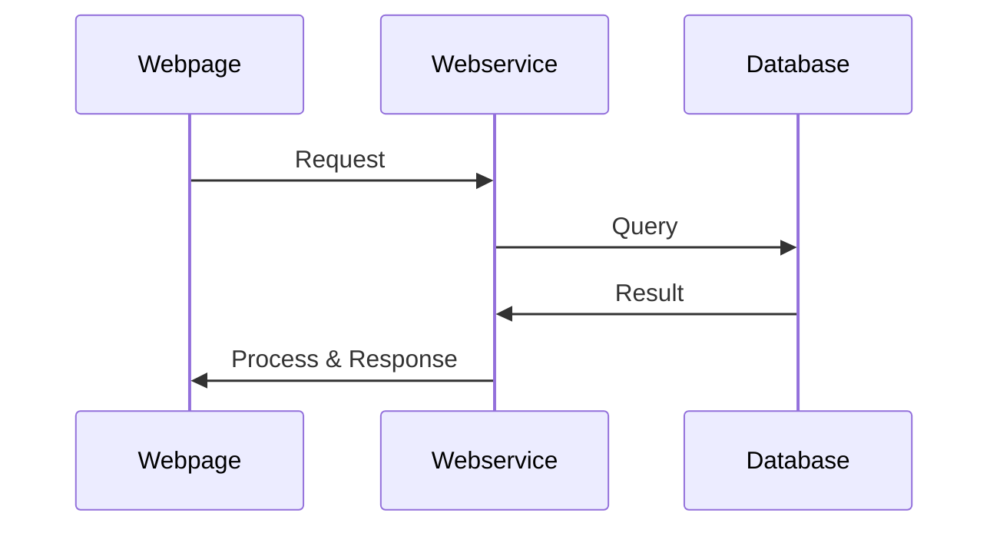

# # GoFiber-101

This project aim to guide newcomer to understand [gofiber](https://github.com/gofiber/fiber) web framework in a short period .

# Quick run

    git clone https://github.com/zercle/gofiber-101.git
    go run main.go

## Resources

- [The Go Programming Language](https://go.dev/)
- [Welcome - Fiber (gofiber.io)](https://docs.gofiber.io/)
- [GORM Guides | GORM - The fantastic ORM library for Golang, aims to be developer friendly.](https://gorm.io/docs/)
- [JSON:API — Examples (jsonapi.org)](https://jsonapi.org/examples/)

## UML diagrams

This project try simulate full stack web development

